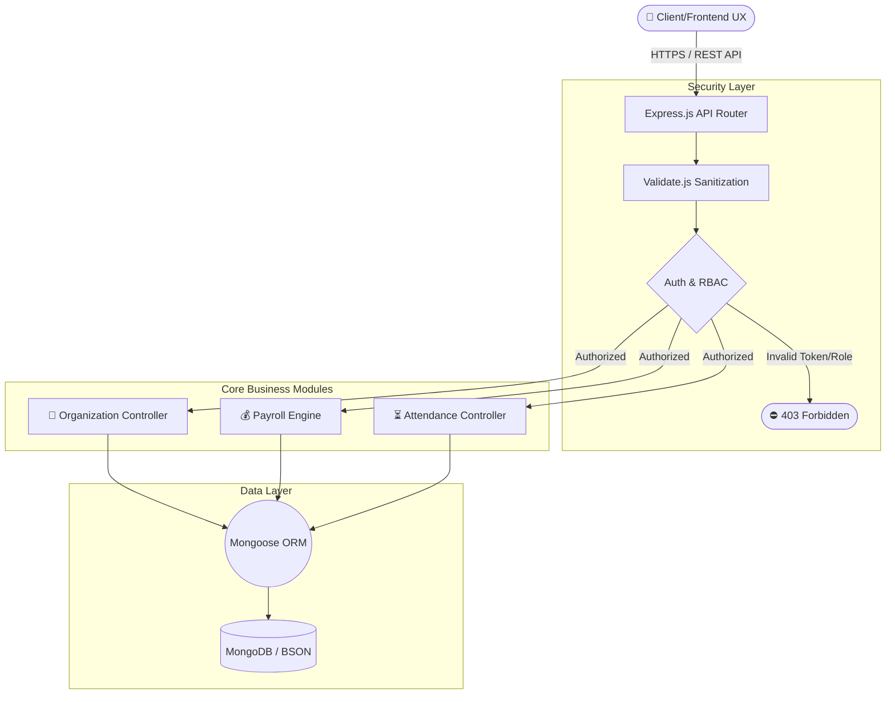
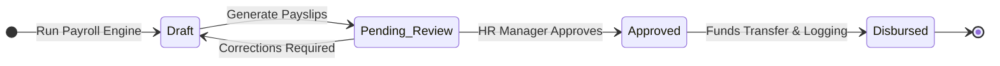
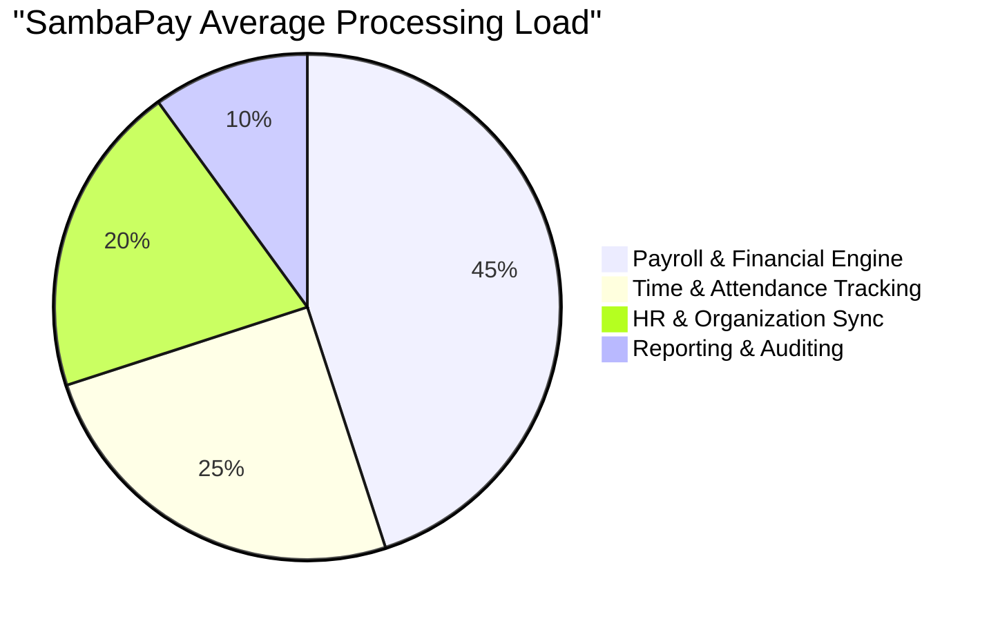

<div align="center">

# 🌟 SambaPay Enterprise Suite 🌟
**Next-Generation HR, Payroll, & Organizational Management API**

[](#)
[](#)
[](#)
[](#)
[](#)

<br>
<p>
  <i>A powerful, decoupled backend architecture designed to handle modern enterprise organizational structures, time tracking, dynamic payroll routing, and strict role-based access controls.</i>
</p>

[**Architecture Diagrams**](#-interactive-architecture--flow-diagrams) • [**Explore Features**](#-core-modules) • [**Getting Started**](#-quick-start)

</div>

---

## 🧭 Table of Contents
1. [Interactive Architecture & Flow Diagrams](#-interactive-architecture--flow-diagrams)
2. [Core Modules](#-core-modules)
3. [Security & Authentication](#-security--authentication)
4. [Tech Stack](#-tech-stack)
5. [Quick Start (Interactive)](#-quick-start)

---

## 📐 Interactive Architecture & Flow Diagrams

SambaPay uses a decoupled, headless architecture separating the UX from the Backend API. Below are the interactive architectural flow graphs (rendered via Mermaid.js natively in Markdown).

### Core System Flow


### Payroll Processing Lifecycle Graph


### System Workload Distribution


---

## 🧩 Core Modules

| Module | Description | Key Controllers |
|:---|:---|:---|
| 🏢 **Organization** | Manages departments, company structure, and active employee contracts. | `OrganizationController`, `EmployeeController` |
| ⏳ **Time & Attendance** | Check-ins, leave allocations, schedules, and time-off tracking. | `AttendanceController`, `LeaveController` |
| 💰 **Payroll Engine** | Financial core handling dynamic salary rules, structures, and payslip generation. | `PayrollController`, `PayslipController` |
| 📊 **Reporting & Audit** | Analytical endpoints for HR reports and compliance audit trails. | `ReportController`, `AuditLog` |

---

## 🛡 Security & Authentication

Security is deeply integrated into the SambaPay API lifecycle.

<details>
<summary><b>🔐 Click to expand Security Details</b></summary>

> - **Authentication Pipeline:** Handled by `authController.js` and the robust `User.js` model. Issues secure sessions/tokens.
> - **Role-Based Access Control (RBAC):** Middleware (`rbac.js`) ensures strict separation of duties (e.g., Admin vs. HR vs. Employee).
> - **Cryptography:** Passwords are irreversibly hashed with `bcrypt` / `bcryptjs`.
> - **Request Sanitization:** Incoming payloads are strictly validated and parsed using `validate.js`, `body-parser`, and `accepts`.
</details>

---

## 💻 Tech Stack

<div align="center">
  <table>
    <tr>
      <td align="center" width="25%"><b>Runtime</b><br><br></td>
      <td align="center" width="25%"><b>Framework</b><br><br></td>
      <td align="center" width="25%"><b>Database</b><br><br></td>
      <td align="center" width="25%"><b>Package Manager</b><br><br></td>
    </tr>
  </table>
</div>

---

## 🚀 Quick Start 

Follow these steps to get SambaPay running locally.

<details>
<summary><b>⚙️ 1. Environment Setup (Click to Expand)</b></summary>
<br>

Create a `.env` file in the `backend/` directory:
```env
PORT=3000
MONGODB_URI=mongodb://localhost:27017/sambapay
JWT_SECRET=your_super_secret_key
NODE_ENV=development
```
</details>

<details>
<summary><b>📦 2. Installation & Execution (Click to Expand)</b></summary>
<br>

Run the following commands in your terminal:

```bash
# Navigate to the backend directory
cd sambapay/backend

# Install all dependencies (bcrypt, mongoose, body-parser, etc.)
npm install

# Start the server
npm run dev
```
</details>

<br>
<p align="center">
  <i>Developed with ❤️ for enterprise efficiency.</i>
</p>
