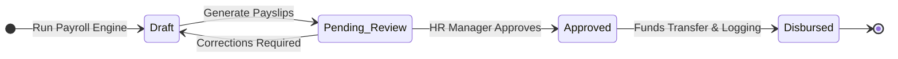
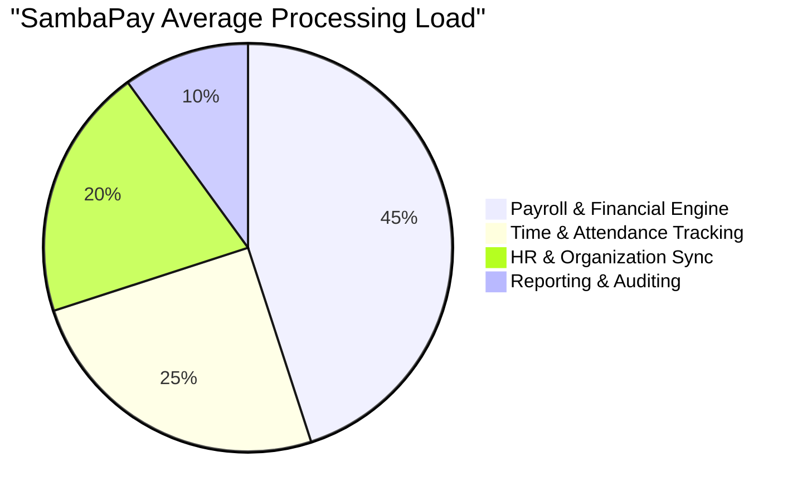
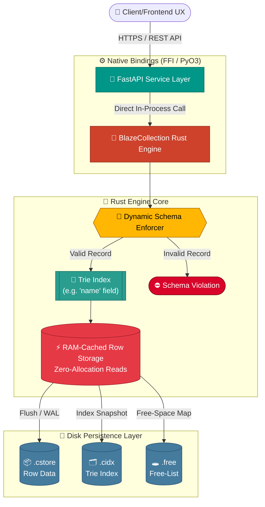

<div align="center">

# 🌟 SambaPay Enterprise Suite 🌟
**Next-Generation HR, Payroll, & Organizational Management API**

[](#)
[](#)
[](#)
[](#)
[](#)
[](#)
[](#)

<br>
<p>
  <i>A powerful, decoupled backend architecture designed to handle modern enterprise organizational structures, time tracking, dynamic payroll routing, and strict role-based access controls.</i>
</p>

[**Architecture Diagrams**](#-interactive-architecture--flow-diagrams) • [**Explore Features**](#-core-modules) • [**BlazeCollection Engine**](#-future-implementation-blazecollection-rust-engine) • [**Getting Started**](#-quick-start)

</div>

---

## 🧭 Table of Contents
1. [Interactive Architecture & Flow Diagrams](#-interactive-architecture--flow-diagrams)
2. [Core Modules](#-core-modules)
3. [Security & Authentication](#-security--authentication)
4. [Tech Stack](#-tech-stack)
5. [🚀 Future Implementation: BlazeCollection (Rust Engine)](#-future-implementation-blazecollection-rust-engine)
6. [Quick Start (Interactive)](#-quick-start)

---

## 📐 Interactive Architecture & Flow Diagrams

SambaPay uses a decoupled, headless architecture separating the UX from the Backend API. Below are the interactive architectural flow graphs (rendered via Mermaid.js natively in Markdown).

### Core System Flow


### Payroll Processing Lifecycle Graph


### System Workload Distribution


---

## 🧩 Core Modules

| Module | Description | Key Controllers |
|:---|:---|:---|
| 🏢 **Organization** | Manages departments, company structure, and active employee contracts. | `OrganizationController`, `EmployeeController` |
| ⏳ **Time & Attendance** | Check-ins, leave allocations, schedules, and time-off tracking. | `AttendanceController`, `LeaveController` |
| 💰 **Payroll Engine** | Financial core handling dynamic salary rules, structures, and payslip generation. | `PayrollController`, `PayslipController` |
| 📊 **Reporting & Audit** | Analytical endpoints for HR reports and compliance audit trails. | `ReportController`, `AuditLog` |

---

## 🛡 Security & Authentication

Security is deeply integrated into the SambaPay API lifecycle.

<details>
<summary><b>🔐 Click to expand Security Details</b></summary>

> - **Authentication Pipeline:** Handled by `authController.js` and the robust `User.js` model. Issues secure sessions/tokens.
> - **Role-Based Access Control (RBAC):** Middleware (`rbac.js`) ensures strict separation of duties (e.g., Admin vs. HR vs. Employee).
> - **Cryptography:** Passwords are irreversibly hashed with `bcrypt` / `bcryptjs`.
> - **Request Sanitization:** Incoming payloads are strictly validated and parsed using `validate.js`, `body-parser`, and `accepts`.
</details>

---

## 💻 Tech Stack

<div align="center">
  <table>
    <tr>
      <td align="center" width="25%"><b>Runtime</b><br><br></td>
      <td align="center" width="25%"><b>Framework</b><br><br></td>
      <td align="center" width="25%"><b>Database</b><br><br></td>
      <td align="center" width="25%"><b>Package Manager</b><br><br></td>
    </tr>
  </table>
</div>

---

## 🚀 Future Implementation: BlazeCollection (Rust Engine)

<div align="center">

[](#)
[](#)
[](#)
[](#)

</div>

SambaPay's next architectural evolution replaces the Node.js/Express/MongoDB backend with **BlazeCollection** — a **custom-built database format**, purpose-engineered in **Rust** and specialized for exceptionally fast retrieval, append, and deletion operations, exposed to the application layer through a **FastAPI** service boundary.

Rather than adopting a general-purpose document store, BlazeCollection defines its own on-disk and in-memory data layout end-to-end — giving full control over how records are indexed, cached, and persisted. FastAPI communicates directly with the compiled Rust binary through **native bindings** (via PyO3/FFI), eliminating network serialization overhead and enabling:

- ⚡ **Zero-allocation searches** — indexed lookups (retrieval) execute directly against pre-allocated, RAM-resident memory structures with no per-query heap allocation.
- ➕ **Optimized appends** — new records are written straight into RAM-cached row storage and streamed to disk, avoiding the write-amplification typical of general-purpose databases.
- 🗑️ **Fast, low-overhead deletion** — removed records are reclaimed via a dedicated free-space map rather than costly document-store compaction.
- 🧬 **Dynamic schema enforcement** — every record is validated against a flexible, runtime-configurable schema at the point of insertion, rather than being left to loose, unvalidated documents.
- 🌲 **Trie-based indexing** — configurable index fields (e.g. `name`) are stored in a Trie for fast prefix-aware, memory-efficient lookups.
- 💾 **Custom disk persistence** — durable storage is handled through purpose-built binary file formats rather than a general-purpose document store.

### 🔀 BlazeCollection Data Flow



### 📊 Benchmark: MongoDB vs. BlazeCollection (Custom DB)

> Benchmarked against **1,000,000 records**, with dynamic schema enforcement and a universal collection structure.

| # | Metric | 🍃 MongoDB (Bulk) | 🦀 Custom DB (1-by-1, Dtype Checked) | 🏆 Winner |
|:---:|:---|:---:|:---:|:---:|
| 1 | ⏱️ Insert Time | `7.3162 sec` | `3.9024 sec` | 🟩 Custom DB |
| 2 | 🔍 Search Time (1,000 queries, Indexed) | `100.0434 sec` | `34.4736 sec` | 🟩 Custom DB |
| 3 | 🗑️ Delete Time (1,000 deletes, 1-by-1) | `0.1169 sec` | `0.0206 sec` | 🟩 Custom DB |
| 4 | 🧠 RAM Delta (before → after insert) | `244.62 MB` | `21.82 MB` | 🟩 Custom DB |
| 5 | 💽 Disk Usage (Total Size) | `141.38 MB` | `126.01 MB` | 🟩 Custom DB |

**Notes:**
- Schema is enforced dynamically via the Rust engine on **every single record insertion** — not just on bulk batches.
- The index field is dynamically configured to `name`, backed by a Trie structure.

### 🎨 Visual Delta: RAM Usage & Search Time

Each block represents ~10% of the larger value, so you can eyeball the gap at a glance.

**🧠 RAM Delta (before → after insert)**
```
MongoDB     (244.62 MB): 🟥🟥🟥🟥🟥🟥🟥🟥🟥🟥
Custom DB    (21.82 MB): 🟩
```

**🔍 Search Time (1,000 indexed queries)**
```
MongoDB     (100.0434 sec): 🟥🟥🟥🟥🟥🟥🟥🟥🟥🟥
Custom DB    (34.4736 sec): 🟩🟩🟩
```

<div align="center">

**🦀 BlazeCollection delivers ~2.9x faster search and ~11.2x lower RAM overhead at 1M records.**

</div>

---

## 🚀 Quick Start 

Follow these steps to get SambaPay running locally.

<details>
<summary><b>⚙️ 1. Environment Setup (Click to Expand)</b></summary>
<br>

Create a `.env` file in the `backend/` directory:
```env
PORT=3000
MONGODB_URI=mongodb://localhost:27017/sambapay
JWT_SECRET=your_super_secret_key
NODE_ENV=development
```
</details>

<details>
<summary><b>📦 2. Installation & Execution (Click to Expand)</b></summary>
<br>

Run the following commands in your terminal:

```bash
# Navigate to the backend directory
cd sambapay/backend

# Install all dependencies (bcrypt, mongoose, body-parser, etc.)
npm install

# Start the server
npm run dev
```
</details>

<br>
<p align="center">
  <i>Developed with ❤️ for enterprise efficiency.</i>
</p>
